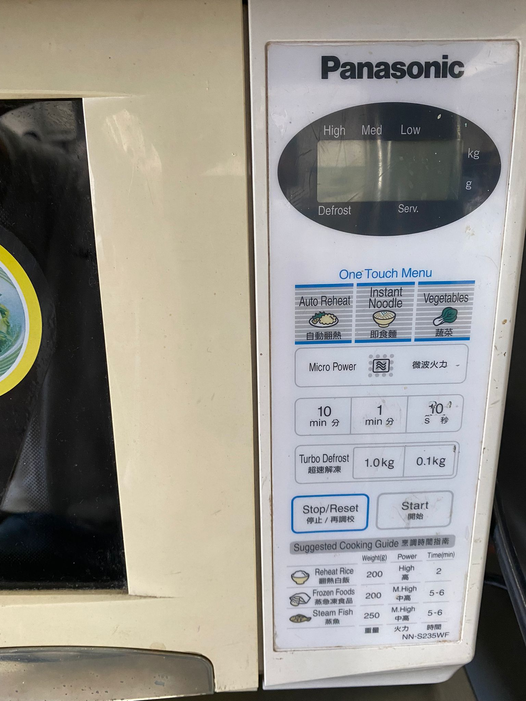
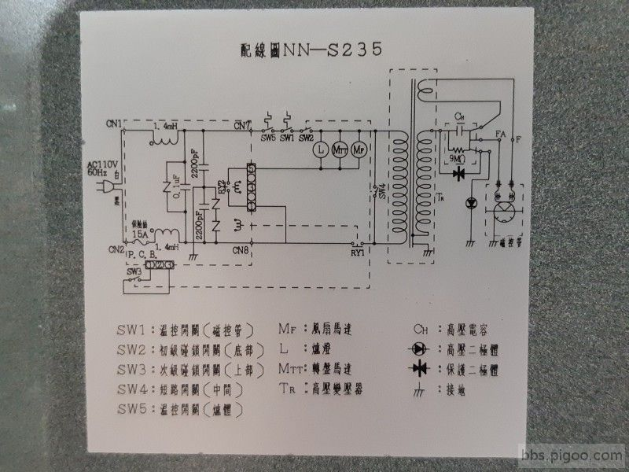
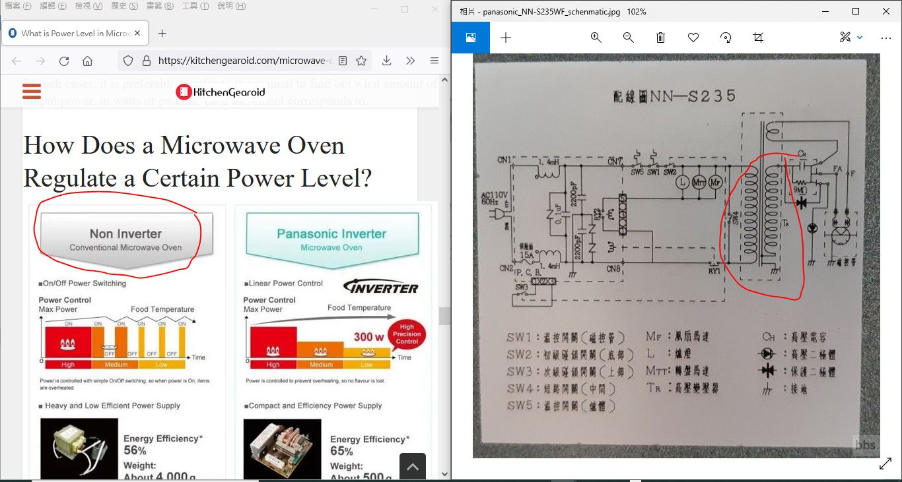
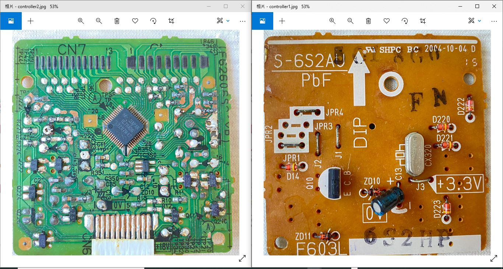
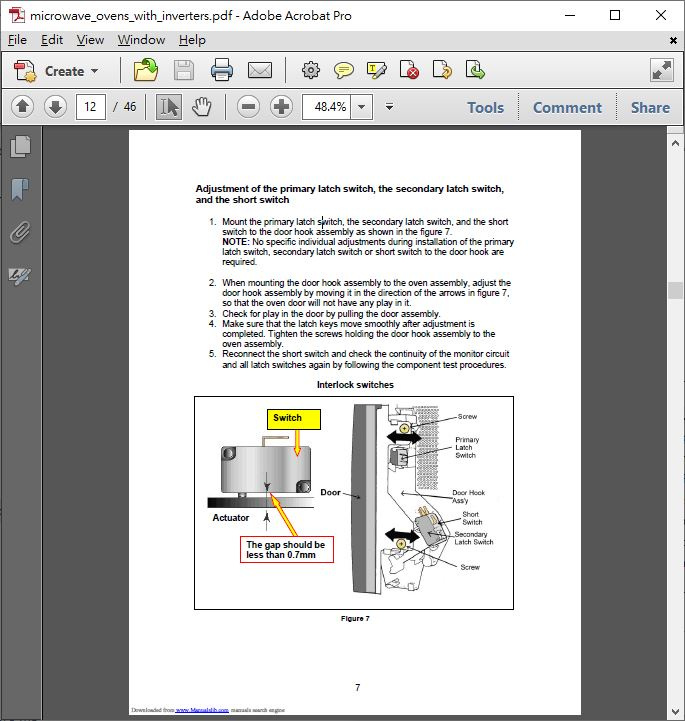
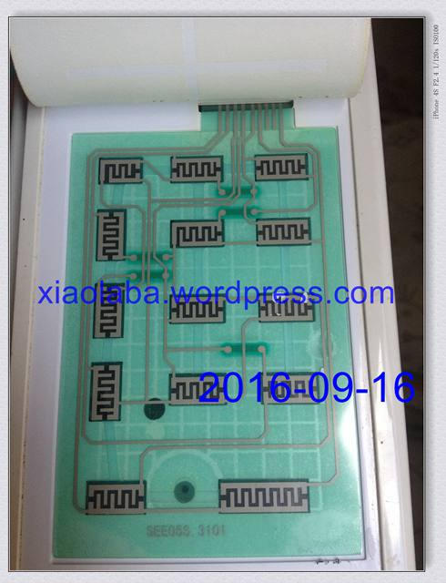
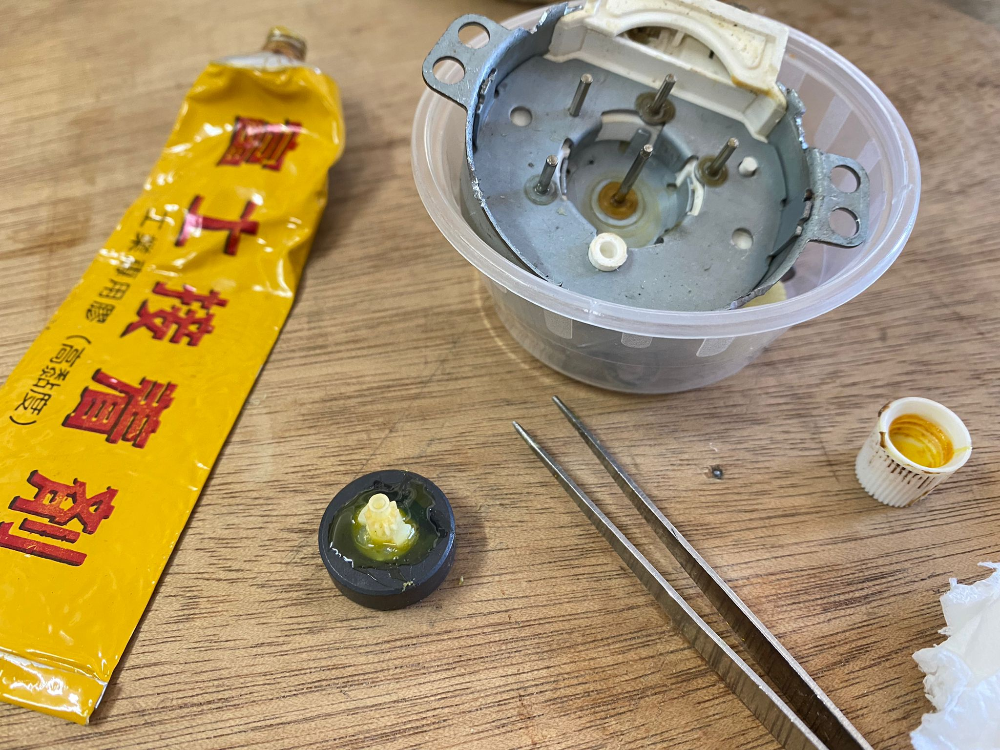

# Panasonic_NN-S235WF_microwave_oven  
hack and build the controller.  
it is US$100 kitchen tools and became a toy once malfuction, why so easy broken tools?  

MN101C78A, mask rom MCU, no way to replace or repair this microwave oven as controller broad malfunctioning suddently.  
Panasonic build the MCU and matsushita manufacturing, later nvuoton brand named.  
see datasheet [IC_datasheet](IC_datasheet)  

### user manual  
[user manual, service manual etc. pretty much useless, not for component level of trouble shooting](manual)  

### symtom  
LCD has no display, power supply and 18V is good, on-broad 3.3V is good, 8MHz xtal is good, reset circuit is good. so the only problem came to be fault of this MCU.  
  

### circuit diagram of the oven  
  

### to understand how this microwave oven regulated the power
ON-OFF control for transformer to power magnetron, that the esential of regulated the power of microwave oven (old model without uses of inverter design)  
  

### controller PCB
  

### why the SHORT SWITCH (or Monitor SWITCH) and why fuse burn  
[see tranining and why manual](manual)  
  

### to build my own controller ?
this is no much more than a "timer" + relays to control for the microwave oevn, the following is reference, and perhaps good however the license was saying no any publish could be allowed as saying with an opensource code & project ?
https://extremeelectronics.co.in/avr-projects/microwave-controller-using-atmega8-avr-project/

### try arduino and open source code  
LCD1602, a few button and code, it is easy, ON-OFF control and timer setting would be only barrier for the project. let us see what would be.

### last time membrane fault, key press and repair by cleaning
project log, [panel_fix](panel_fix)  
  

### last time plate motor fix by glue
project log,[plate_motor_fix](plate_motor_fix)   
   

